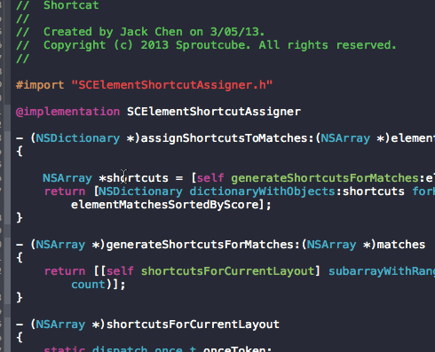

# Fuzzy Autocomplete for Xcode

## `FuzzyAutocomplete 2.0` 
 
This is a Xcode 5+ plugin that patches the autocomplete filter to work the same way the **Open Quickly** works. It performs very well, and the fuzzy matching actually uses Xcode's own `IDEOpenQuicklyPattern`.

For Xcode 6 Beta and Swift support check out the `xcode6` branch.

## Authors
FuzzyAutocomplete is brought to you by:

* [Jack Chen (chendo)](http://github.com/chendo) - original creator of the plugin
* [Leszek Ślażyński (slazyk)](http://github.com/slazyk) - author of the 2.0 version

See @chendo's original blog post about how he figured out what to patch: [Reverse engineering Xcode with dtrace](http://chen.do/blog/2013/10/22/reverse-engineering-xcode-with-dtrace/?utm_source=github&utm_campaign=fuzzyautocomplete)

Like nifty tools like this plugin? Check out [Shortcat](https://shortcatapp.com/?utm_source=github&utm_campaign=fuzzyautocomplete), an app by @chendo that lets you control your Mac more effectively with your keyboard!

## Features

### Main Features

* Xcode's autocompletion matches like **Open Quickly** does
* Supports Xcode's learning and context-aware priority system
* [New] Visualizes matches in Completion List and Inline Preview
* [New] Easily customizable via a Settings Window (Editor > FuzzyAutocomplete)
* [New] [Optional] Sorts items by their score for easier searching
* [New] [Optional] Hides items based on a threshold for less clutter
* [New] [Optional] Shows the query and number of matches in Header View
* [New] [Optional] Shows match scores for items in the List
* [New] Selects prev/next completion with shortcuts (default `⌃>` / `⌃.`) 
* [Optional] Treats first few query letters as a required prefix
* Productivity++
  
*[New] denotes a feature added in 2.0*  
*[Optional] denotes a feature which can be configured in settings*

## Compatibility
* Supports Xcode 5.1, 5.0
* Compatible with [KSImageNamed](https://github.com/ksuther/KSImageNamed-Xcode)

## Installation

* Either:
  * Install with [Alcatraz](http://alcatraz.io/)
  * Clone and build the project
  * Download and unzip a release to  
  `~/Library/Application Support/Developer/Shared/Xcode/Plug-ins/`
* Restart Xcode and enjoy!  
  * You should now see a `FuzzyAutocomplete` menu item in `Editor` menu

## Changelog

#### 2.0.1 - 2014/04/25
**A minor update with small bugfixes and improvements, including:**

* Replaced letter- and prefix- caches with simple cached results stack  
  thus making backspacing much faster (Issue #29)
* Previous/Next completion shortcuts now work properly (Issue #36)
* Completion List now automatically shows for one letter (Issue #37)
* Hide Inline Preview more reliably when disabled in settings
* Moved FuzzyAutocomplete menu item into Editor menu
* Added option to disable plugin in settings
* Fixed alphabetical sorting of results when using parallel scoring
* Reliability++
* Performance++

#### 2.0.0 - 2014/04/16
**A major update introducing many fixes and improvements, including:**

* Visual feedback in Completion List and Inline Preview
* Settings Window, settings now don't require Xcode restart
* Option to sort items by match score
* Option to hide items based on threshold
* Option to hide Inline Preview, which now works correctly
* Option to show a List Header with query and number of matches
* Option to show item scores in the List
* Improved score formula, added option to tweak parameters
* Previously hidden items can now re-appear if their score rises
* `Tab` now inserts an useful prefix based on whole fuzzy match
* The results should no longer depend on the speed of typing
* Got rid of order dependent "shortest match" selection mechanism
* Performance++
* UX++
* ...

#### [Full Changelog](CHANGELOG.md)

